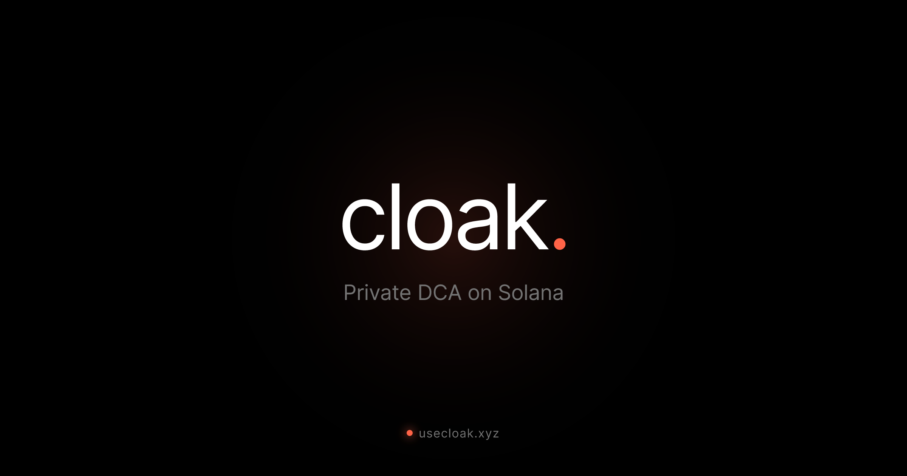

<div align="center">
  

  <h1>cloak.</h1>
  <p><strong>The private way to accumulate crypto</strong></p>

  <a href="https://usecloak.xyz">Website</a> •
  <a href="#how-it-works">How It Works</a> •
  <a href="#tech-stack">Tech Stack</a> •
  <a href="#getting-started">Get Started</a>

  ---
</div>

Cloak is a privacy-preserving DCA (Dollar Cost Averaging) application built on Solana. Accumulate SOL, cbBTC, and ZEC without revealing your trading strategy on-chain.

## 🔍 The Problem

Traditional DCA on Solana is **fully transparent**:

| What's Exposed | Risk |
|----------------|------|
| Your wallet address | Anyone can track you |
| Buy schedule | Predictable patterns |
| Accumulation strategy | Front-running & copy trading |
| Transaction history | Permanent public record |

## 🛡️ The Solution

Cloak breaks the on-chain link between you and your trades:

```
Your Wallet → Privacy Pool → Session Wallet → Jupiter Swap → Session Wallet → Any Wallet
                   ↑              ↑                                              ↑
            (ZK shielded)   (unlinkable)                                  (your choice)
```

**Nobody can connect your deposits to your DCA trades or prove that you're running a strategy.**

## ⚡ How It Works

| Step | Action | What Happens |
|------|--------|--------------|
| 1️⃣ | **Deposit** | Shield your USDC into a privacy pool (mixed with others) |
| 2️⃣ | **Configure** | Set target token, amount per trade, and frequency |
| 3️⃣ | **Sit Back** | Keeper executes your trades on schedule via Jupiter |
| 4️⃣ | **Withdraw** | Send accumulated tokens to any wallet

## 🧱 Tech Stack

**Privacy & Blockchain**
- [Privacy.cash](https://privacy.cash) — ZK-proof privacy pool
- [Light Protocol](https://lightprotocol.com) — ZK compression & cryptography
- [Jupiter](https://jup.ag) — DEX aggregation
- [Helius](https://helius.dev) — Solana RPC (primary)
- [Quicknode](https://quicknode.com) — Solana RPC (fallback)

**Frontend & Backend**
- Next.js 16 + React 19 + TailwindCSS 4
- Zustand (state management)
- Supabase (database)
- Railway (hosting)

## 🏗️ Architecture

```
┌─────────────────┐     ┌─────────────────┐     ┌─────────────────┐
│   Frontend      │────▶│   API Routes    │────▶│    Supabase     │
│   (Next.js)     │     │   (Next.js)     │     │   (Postgres)    │
└─────────────────┘     └─────────────────┘     └─────────────────┘
                               │
                               ▼
              ┌────────────────────────────────────────┐
              │           Solana Blockchain            │
              │                                        │
              │   Privacy.cash ──► Light Protocol      │
              │        │                               │
              │        └──────► Jupiter DEX            │
              │                                        │
              └────────────────────────────────────────┘
```

## 🚀 Getting Started

### Prerequisites

- Node.js 20.9+
- A Solana wallet (Phantom or Solflare)
- Supabase account
- Helius RPC API key (recommended)

### Installation

```bash
# Clone the repository
git clone https://github.com/vaibhav0806/cloak-dca.git
cd cloak-dca

# Install dependencies
npm install

# Set up environment variables
cp .env.example .env.local
```

### Environment Variables

Create a `.env.local` file:

```env
# Supabase
NEXT_PUBLIC_SUPABASE_URL=your_supabase_url
NEXT_PUBLIC_SUPABASE_ANON_KEY=your_anon_key
SUPABASE_SERVICE_KEY=your_service_key

# Solana RPC
NEXT_PUBLIC_HELIUS_RPC_URL=https://mainnet.helius-rpc.com/?api-key=your_key
NEXT_PUBLIC_HELIUS_RPC_URL_DEVNET=https://devnet.helius-rpc.com/?api-key=your_key

# Keeper Authentication
CRON_SECRET=your_random_secret
```

### Database Setup

Run the Supabase migrations:

```bash
npx supabase db push
```

Or manually create the tables in Supabase SQL editor (see `/supabase/migrations/`).

### Development

```bash
npm run dev
```

Open [http://localhost:3000](http://localhost:3000).

### Testing the Keeper

```bash
# Trigger DCA execution manually
curl -H "Authorization: Bearer your_cron_secret" http://localhost:3000/api/keeper/execute
```

## 🌐 Deployment

### Railway (Recommended)

1. Connect your GitHub repo to Railway
2. Set environment variables in Railway dashboard
3. Deploy

### Vercel (Alternative)

```bash
vercel deploy --prod
```

### Environment Variables

Set all variables from `.env.local` in your hosting provider's dashboard.

## 📡 API Endpoints

| Endpoint | Method | Description |
|----------|--------|-------------|
| `/api/dca/create` | POST | Create a new DCA |
| `/api/dca/list` | GET | List user's DCAs |
| `/api/dca/[id]/pause` | POST/DELETE | Pause/Resume DCA |
| `/api/dca/[id]/cancel` | POST | Cancel DCA |
| `/api/dca/[id]/executions` | GET | Get execution history |
| `/api/privacy/balance` | POST | Get shielded balances |
| `/api/privacy/deposit` | POST | Deposit to privacy pool |
| `/api/privacy/withdraw` | POST | Withdraw from privacy pool |
| `/api/keeper/execute` | GET | Execute due DCAs (cron) |

## 🔐 Privacy Model

| Data | Visible? | |
|------|----------|---|
| Deposit to privacy pool | ✅ Yes | Public deposit, but mixed with others |
| Which UTXO is yours | ❌ No | ZK proofs hide ownership |
| Session wallet swaps | ✅ Yes | Visible but unlinked to you |
| Link: Your wallet ↔ Session | ❌ No | **Broken by privacy pool** |
| DCA schedule/amounts | ❌ No | Stored encrypted off-chain |
| Link: Deposit ↔ Withdrawal | ❌ No | **Unlinkable** |

## 💰 Fees

| Fee | Amount |
|-----|--------|
| Privacy.cash Protocol | ~70-80% of withdrawal |
| Jupiter Swap | ~0.1-0.5% |
| Solana Transaction | ~0.000005 SOL |

## ⚠️ Limitations

- Minimum DCA frequency: 15 minutes
- Privacy.cash fees can be significant for small amounts
- Session keypair stored as base64 (not encrypted) — hackathon demo only
- Output tokens are not re-shielded (visible in session wallet, but unlinked to you)

## 🔒 Security Notes

For production:
- Encrypt session keypairs before storing
- Add rate limiting to API endpoints
- Implement error recovery for failed transactions
- Add monitoring and alerts for keeper failures

## 🤝 Contributing

Contributions welcome! Open an issue or PR.

## 📄 License

MIT

---

<div align="center">
  <strong>Built with privacy in mind</strong>
  <br /><br />
  <a href="https://privacy.cash">Privacy.cash</a> •
  <a href="https://lightprotocol.com">Light Protocol</a> •
  <a href="https://jup.ag">Jupiter</a> •
  <a href="https://helius.dev">Helius</a> •
  <a href="https://quicknode.com">Quicknode</a> •
  <a href="https://supabase.com">Supabase</a>
</div>
